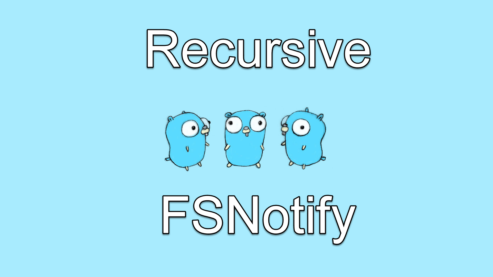

# R-FSNotify

> This project is still under development and its API is not stable. Please use it with caution or wait until this message is removed and the first version is released.

A recursive file watcher package based on `github.com/fsnotify/fsnotify`.

Unfortunately, `fsnotify` does not have recursive watching capability, and you need to write your way to find all the sub-folders and files underneath and add them by using its `Add()` method.

R-FsNotify is the solution for that problem. It automatically watches all of your files under a directory.

Since this package is still under development, the API surface may change as the new requirements come up. Therefore, until the first release is fully published, use this library with caution.

## Note
This project is still under development and if you like you can watch the all of the live streams during which this package has been actively developed.

Watch the development series here: https://www.youtube.com/watch?v=_bePpkKfU5s&list=PL_Z0TaFYSF3J8bCnGTIdZ_YgSH2THmzZt

Developed by @tarikguney with <3